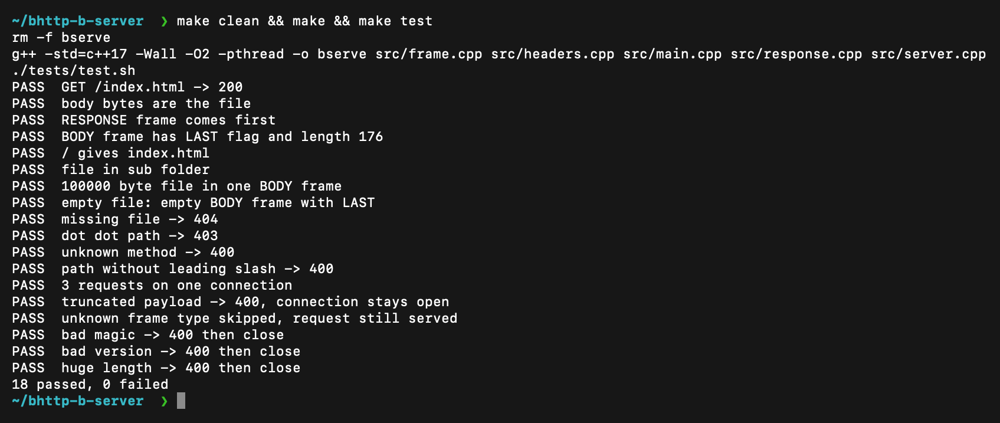
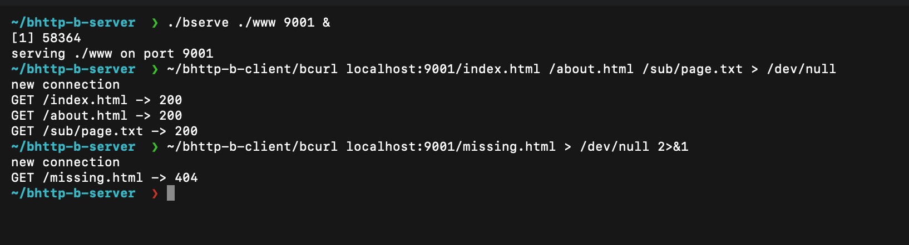

# bserve (BHTTP-B server)

The server part of our course project "HTTP in binary". It serves files over BHTTP-B, a small binary protocol
with an 8 byte frame header. The protocol is described in `SPEC.md`, and `HEXDUMP.md` has one request and
response with every byte explained.

## Build and run

    make
    ./bserve ./www 9001

The first argument is the folder with the files and the second is the port. Use `make clean` to remove the program.
You can try it with the client in Prateek's repo:

    ./bcurl -v localhost:9001/index.html

## How it works

The server accepts a TCP connection and starts a thread for it. The thread reads a frame (8 byte header with
magic, version, type, flags and length, then the payload). For a REQUEST it decodes the method, the path and
the headers and looks for the file under the root folder. It answers with a RESPONSE frame (status and
headers) and one BODY frame with the whole file. Then it waits for the next request on the same connection,
until the client closes it.

If a frame has a type the server does not know, it reads the payload and throws it away. A wrong magic or version
gets 400 and the connection is closed. The other errors (400, 403, 404, 500) are in section 7 of the spec.

## Code

| File | What is in it |
|------|---------------|
| `src/main.cpp` | arguments, socket, accept loop, one thread per connection |
| `src/server.cpp` | reads the frames of one connection, finds the file |
| `src/response.cpp` | builds RESPONSE and BODY, the error answers |
| `src/headers.cpp` | header field encoding and request parsing, static table |
| `src/frame.cpp` | reading, skipping and writing frames |
| `tests/test.sh` | tests |
| `www/` | files to serve |

## Tests

    make test

This starts the server on port 9101 and sends frames that are built by hand from the spec (`printf`, `xxd`
and `nc`), so our own client is not used. It checks 200, 404, 403, 400, a big file, an empty file, three
requests on one connection, a cut-off payload, an unknown frame type, a wrong magic, a wrong version and a huge
length. It needs `nc` and `xxd`.

## Screenshots

Build and tests (18 checks pass):

The server running and the log of the requests it handled (three files on one connection, then a 404):

## Pair

This is the server for BHTTP-B. It was written by Raghavendra. Prateek wrote the client, and the only thing
we share is SPEC.md.

- server (this repo, Raghavendra): https://github.com/Raghavendra1729-cell/CPP_SERVER
- client (Prateek): https://github.com/<prateek-github-username>/bhttp-b-client
